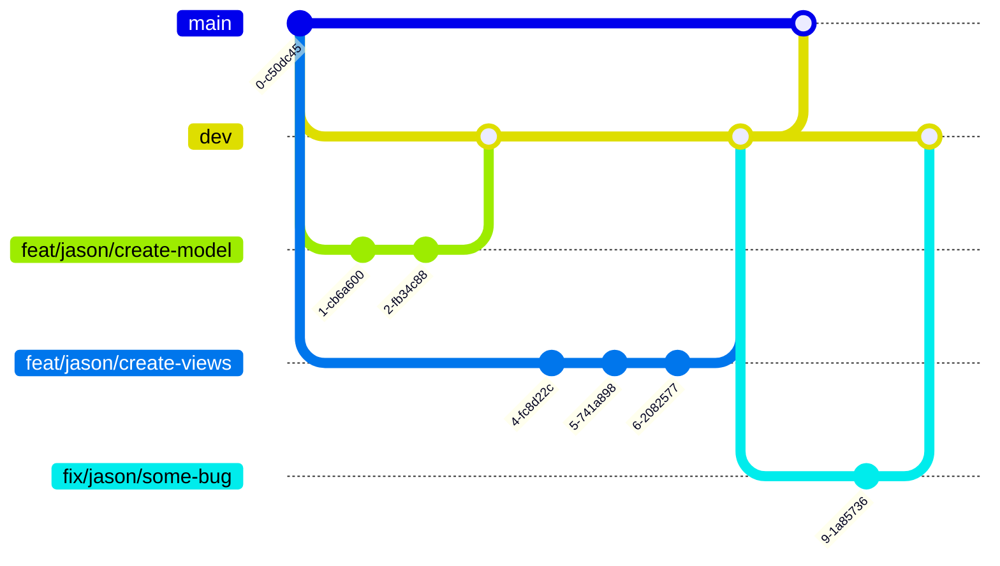

# Git specification

git 规范

## commit message

```
<type>(<scope>): <subject>
```

### Type

- `feat` : 引入新功能
- `fix`: 修复某bug
- `docs` ：修改/添加代码文档（包括readme）
- `style`：修改代码风格（调整代码缩进等格式层面，不涉及代码结构的变动）
- `refactor`：重构（代码结构变动、变量重命名）
- `perf`：提升运行效率、降低复杂度
- `test`：添加/修改/删除测试单元
- `revert`：回滚版本
- `merge`：代码合并
- `sync`：同步master/dev分支
- `init`：创建新仓库/分支

### Scope

命名规范：backend-something / frontend-something

something 可以是model、view、util、network、ui等

#### Example

后端开发完成用户model的设计：

```
feat(backend-model) : model ‘User’ completed, added fields ‘id’, ‘user_name’, ‘password’, ‘register_time’
```

## Branch

- 主分支：`master`，只能合并`dev`分支，当阶段成果无bug时合并。
- 开发分支：`dev`，任何修改操作（确认无bug后）都合并到这个分支内
- 其他分支：命名规范`type/username/description`，`type`规范与commit message的规范一致，每引入一个feature/fix一个bug都要（从`dev`分支）拉一个分支。

例：



## Issue

每次拉取分支都是基于一个issue（可以自己发布，并assign 给自己）,同时新建一个merge request，详细流程见下：

[基于Gitlab Issues为导向的分支管理-CSDN博客](https://blog.csdn.net/u011423145/article/details/107860812)

> - Branch Name 一定要规范，在新建 merge request的时候新建branch，任何新branch都是基于dev分支的
> - 对于 merge request，合并后一定要删除旧分支
> - 留意自己的 commit message（> 20 字符）和单次提交代码行数（<500行）
> 
{style="warning"}